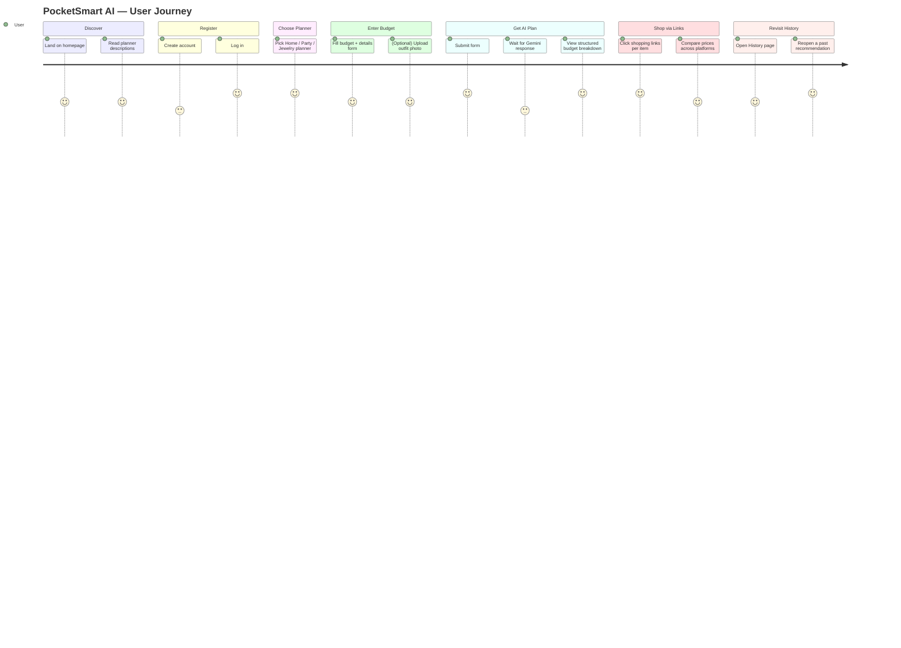

# Customer Journey Map

## Stage-by-stage notes

| Stage | User goal | System response | Friction point addressed |
|---|---|---|---|
| Discover | Understand what the tool does | Landing page explains 3 planners + testimonials | Builds trust before signup |
| Register | Create an account | JWT-backed registration, bcrypt-hashed password | No external OAuth dependency to configure |
| Choose Planner | Pick the relevant scenario | Dashboard with 3 clear entry points | Avoids a single overloaded form |
| Enter Budget | Describe constraints | Grouped form sections, validated inputs | Prevents invalid budgets (≤0, negative counts) |
| Get AI Plan | Receive an actionable plan | Gemini 3.5 Flash-Lite (+ fallback on failure) | Never shows a raw error to the user |
| Shop via Links | Act on the plan | Pre-built search URLs per platform | Removes manual searching |
| Revisit History | Recall previous plans | Per-user in-memory history, sorted newest-first | No loss of past planning work within a session |
