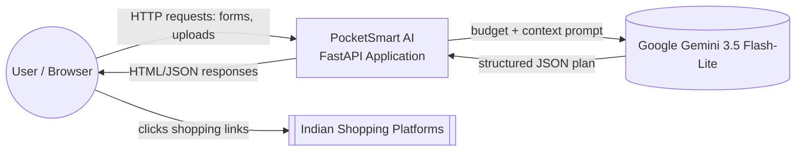
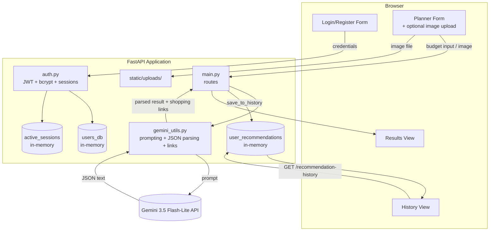

# Data Flow Diagram

## Level 0 — Context Diagram

```mermaid
flowchart LR
    User((User / Browser))
    PocketSmart[PocketSmart AI\nFastAPI Application]
    Gemini[(Google Gemini 3.5 Flash-Lite)]
    Shops[[Indian Shopping Platforms]]

    User -->|HTTP requests: forms, uploads| PocketSmart
    PocketSmart -->|HTML/JSON responses| User
    PocketSmart -->|budget + context prompt| Gemini
    Gemini -->|structured JSON plan| PocketSmart
    User -->|clicks shopping links| Shops
```

## Level 1 — Internal Data Flow

```mermaid
flowchart TD
    subgraph Browser
        A[Login/Register Form]
        B[Planner Form\n+ optional image upload]
        C[Results View]
        D[History View]
    end

    subgraph FastAPI[FastAPI Application]
        E[auth.py\nJWT + bcrypt + sessions]
        F[main.py\nroutes]
        G[gemini_utils.py\nprompting + JSON parsing + links]
        H[(users_db\nin-memory)]
        I[(active_sessions\nin-memory)]
        J[(user_recommendations\nin-memory)]
        K[static/uploads/]
    end

    L[(Gemini 3.5 Flash-Lite API)]

    A -->|credentials| E
    E --> H
    E --> I
    B -->|budget input / image| F
    F --> G
    G -->|prompt| L
    L -->|JSON text| G
    G -->|parsed result + shopping links| F
    F -->|save_to_history| J
    B -->|image file| K
    F --> C
    D -->|GET /recommendation-history| J
    J --> D
```
