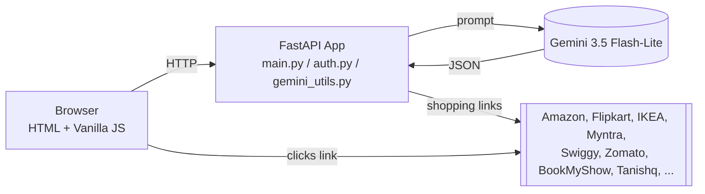

# PocketSmart AI — Your Smart Budget & Recommendation Assistant

A GenAI-powered, budget-constrained recommendation system. Enter a budget and some context, and Google **Gemini 3.5 Flash-Lite** returns a structured, itemized plan — priced in INR, with real shopping search links across major Indian platforms.

## The three planners

1. **Home Interior Planner** — budget, counts of lights/fans/furniture/dining tables, rooms to include, and free-text requirements → a category-by-category furnishing plan sourced from IKEA, Amazon, Flipkart, Myntra, Ajio.
2. **Party Budget Planner** — budget, guest count, party type, venue type, and catering/decoration/entertainment toggles → a proportional budget allocation with vendor suggestions from Swiggy, Zomato, OYO, BookMyShow, and more.
3. **Jewelry Planner** — budget, occasion, style preferences, and an **optional outfit photo** → Gemini's multimodal vision analyzes the outfit's colors/style/formality and recommends matching jewelry from Amazon, Flipkart, BlueStone, Tanishq, CaratLane, Melorra, Meesho.

Every recommendation is saved to the user's history and can be reopened later.

## Features

- JWT-based auth with bcrypt password hashing and httponly session cookies
- Automatic session expiry after 30 minutes of inactivity
- Server-side input validation on every planner (budget > 0, guest/count bounds, image size/type)
- Multi-model fallback chain (cheapest Gemini model tried first) + static fallback so a Gemini outage or quota limit never breaks the UI
- Per-user recommendation history with full-detail lookup
- Responsive, hand-built navy/paper/gold design system (no UI framework)
- Full pytest suite with Gemini calls mocked (no API key required to test)

## Tech stack

| Layer | Choice |
|---|---|
| Backend | FastAPI + Uvicorn |
| AI | Gemini 3.5 Flash-Lite (`google-generativeai`) — text + multimodal |
| Templating | Jinja2 (server-rendered HTML) |
| Frontend | Vanilla HTML/CSS/JS — no build step |
| Auth | JWT (`python-jose`) + bcrypt (`passlib`), httponly cookie |
| Storage | In-memory Python dicts (demo-scale; see Scalability & Future Plan) |
| Testing | pytest + FastAPI `TestClient` |

> **Note on Flask vs FastAPI:** the original project brief's architecture narrative mentions Flask, but all of its actual code excerpts are FastAPI. This build follows the code, not the prose, and implements FastAPI throughout.

> **Note on model version:** the original brief specified Gemini 1.5 Flash, which has since been retired by Google (`gemini-1.5-flash` and even `gemini-2.5-flash` now return 404 for new API keys). An intermediate build targeted `gemini-3.8-flash`, which worked but is a costlier, premium-tier model with a free-tier quota of only 20 requests/day — easily exhausted, after which the app silently fell back to static data. The app now tries a **cost-ordered chain of lite-tier models** — `gemini-3.5-flash-lite` → `gemini-2.5-flash-lite` → `gemini-flash-lite-latest` — defined as `MODEL_CANDIDATES` in `gemini_utils.py`. A model that's retired/unavailable (404) is skipped immediately; any other failure (e.g. quota) retries once before moving to the next candidate, so one exhausted or deprecated model no longer takes the whole app to static fallback.

## Architecture



Full diagrams: [Solution Architecture](<./3. Project Design Phase/Solution Architecture.md>), [Data Flow Diagram](<./2. Requirement Analysis/Data Flow Diagram.md>).

## Folder structure

```
<repo-root>/
├── README.md                          ← this file
├── .gitignore
├── 1. Brainstorming & Ideation/
├── 2. Requirement Analysis/
├── 3. Project Design Phase/
├── 4. Project Planning Phase/
├── 5. Project Development Phase/
├── 6.Project Testing/
├── 7.Project Documentation/
├── 8.Project Demonstration/
└── Project/                           ← the application
    ├── main.py
    ├── gemini_utils.py
    ├── models.py
    ├── auth.py
    ├── requirements.txt
    ├── .env.example / .env
    ├── README.md
    ├── templates/
    ├── static/
    └── tests/
```

Each numbered folder's original placeholder PDF has been kept and supplemented with a `.md` deliverable containing the real project content.

## Setup & run

```bash
cd Project
python -m venv venv
venv\Scripts\activate          # Windows; use `source venv/bin/activate` on macOS/Linux

pip install -r requirements.txt
cp .env.example .env           # then fill in GOOGLE_API_KEY and SECRET_KEY

uvicorn main:app --reload --port 8000
```

Open **http://127.0.0.1:8000**. Stop with **Ctrl+C**.

> Built and verified against **Python 3.11.9**. If your default Python is newer (e.g. 3.13/3.14) and dependency installs fail building native wheels (`pydantic-core`, `pillow`), create the venv with a 3.11 interpreter instead (e.g. `py -3.11 -m venv venv` on Windows).

Run tests:

```bash
cd Project
pytest tests/ -v
```

## Environment variables

| Variable | Required | Notes |
|---|---|---|
| `GOOGLE_API_KEY` | Recommended | Your Gemini API key. If unset, every planner transparently falls back to static recommendations. |
| `SECRET_KEY` | Recommended | Used to sign JWTs. Set to a long random string in any real deployment. |

## API endpoints

| Method | Path | Auth | Purpose |
|---|---|---|---|
| GET | `/` | Public | Landing page |
| GET | `/login`, `/register` | Public | Auth pages |
| POST | `/register` | Public | Create an account |
| POST | `/token` | Public | Log in, returns JWT + sets cookie |
| POST | `/logout` | Session | Blacklist token, clear cookie |
| GET | `/dashboard` | Session | User dashboard |
| GET | `/home-planner`, `/party-planner`, `/jewelry-planner`, `/history` | Session | Planner/history pages |
| GET | `/session-info` | Session | Current session details |
| POST | `/session-data` | Session | Merge data into session |
| POST | `/home-budget` | Session | Home planner recommendation |
| POST | `/party-budget` | Session | Party planner recommendation |
| POST | `/jewelry-budget` | Session | Jewelry planner recommendation (multipart, optional image) |
| GET | `/recommendation-history` | Session | List user's past recommendations |
| GET | `/recommendation-details/{id}` | Session | Full detail of one recommendation |

## Screenshots

*(Add screenshots of the dashboard, each planner's result view, and the history page here after recording a live demo.)*

## Team

*(Add team member names here.)*

## License

Educational/submission project — no license specified.
